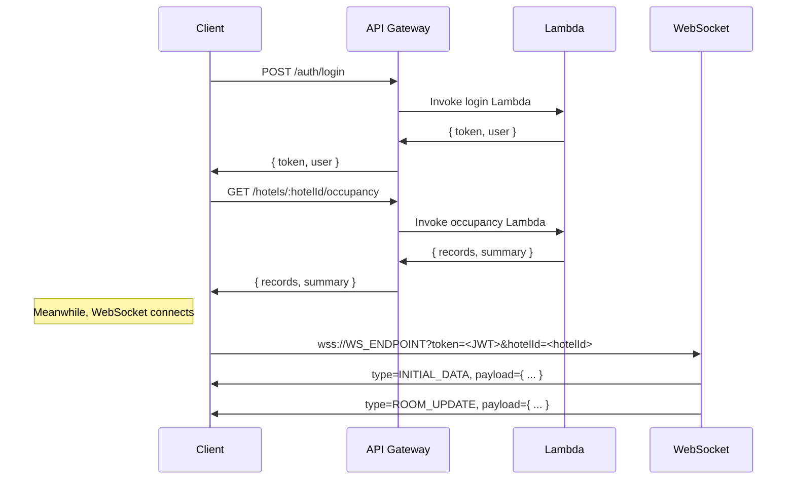

# AWS Integration & API Details

This application leverages various AWS services to provide real-time hotel occupancy data and user authentication. Below is an overview of how these services fit together, along with the primary API endpoints used by the frontend.

---

## 1. AWS Services Overview

### 1.1 AWS Amplify

- **Purpose**: Manages configurations for AWS services and handles authentication tokens and headers in API requests.
- **Usage**:
  - Configured in `src/main.tsx` with `Amplify.configure(...)`.
  - Environment variables (like `VITE_API_REGION` and custom headers) are used to pass the JWT token in the `Authorization` header.

### 1.2 Amazon API Gateway

- **Purpose**: Exposes RESTful endpoints that the frontend calls for fetching occupancy data, user authentication, password resets, etc.
- **Resources**:
  - Deployed as endpoints such as `https://<API_ID>.execute-api.<REGION>.amazonaws.com/<STAGE>/api/v1/...`.
  - Integrates with AWS Lambda for the business logic.

### 1.3 AWS Lambda

- **Purpose**: Serves as the compute layer for your application logic (e.g., retrieving occupancy data, handling auth).
- **Examples**:
  - A **GET** request to `occupancy` endpoints might trigger a Lambda function that queries DynamoDB for the specified hotel and date.

### 1.4 Amazon DynamoDB

- **Purpose**: Stores occupancy records, user information, and other data needed by your application.
- **Schema** (example):
  - **Users Table**: Partition key could be user ID or email associated hotels, etc.
  - **Occupancy Table**: Partition key as hotel ID + date, sort key as room or timestamp.

### 1.5 AWS WebSocket (API Gateway WebSocket)

- **Purpose**: Enables real-time (bi-directional) communication for the **Live Dashboard**.  
- **Endpoint format**: wss://WS_ENDPOINT?token=<JWT>&hotelId=<HOTEL_ID>
- **Handshake**  
1. Client opens the URL above.  
2. On `open`, the frontend sends an explicit  
   ```json
   { "type":"SUBSCRIBE_HOTEL", "payload":{ "hotelId":"<HOTEL_ID>" }, ... }
   ```  
   so the backend can support either query-string or message-based subscription.  
3. A successful backend replies with an **`INITIAL_DATA`** snapshot (rooms + labels).  
- **Keep-alive** – the client fires a PING every **30 000 ms**; the server should answer with its own `PING`.  
- **Graceful close** – before calling `WebSocket.close()` the client emits a  
```json
{ "type":"DISCONNECT", "payload":null, ... }
```
so the backend can clean up connection state.

Cross-tab resiliency – all messages are mirrored through a BroadcastChannel (websocket_messages) so multiple tabs stay in sync; a second channel (websocket_reconnect) lets any tab trigger a reconnect in its siblings.

---

## 2. WebSockets Integration

### 2.1 Connection Flow

1. **Frontend** checks for a JWT token (`auth_token`) and the currently selected hotel ID (`selectedHotel`).
2. **WebSocketService** (`src/services/websocket.ts`) forms the connection URL:
   ```
   wss://<WS_ENDPOINT>?token={jwt}&hotelId={selectedHotel}
   ```
3. **connect( )** | Skips if a socket is already `OPEN`.
4. **CONNECTING → CONNECTED** | State is tracked in Redux-free internal enum.
5. **SUBSCRIBE_HOTEL** | Sent immediately after `open`.
6. **Ping loop** | Every 30 s; a server PING is echoed back for symmetry.
7. **ACK bookkeeping** | Each outbound message is stored in `pendingMessages`; receipt of a message with the same `messageId` counts as an ACK and removes it.
8. **Automatic reconnect** | Exponential back-off (1 s → 2 s → 4 s … up to 30 s) with **max 5 attempts**. State transitions to **FAILED** after that.
9. **Cross-tab broadcast** | Every message is re-posted on `BroadcastChannel` so late-joining tabs receive the last `INITIAL_DATA`.

### 2.2 WebSocket Message Types

- **INITIAL_DATA**
  - Server → Client
  - Full snapshot on first connect or hotel-switch
  - **Payload Example**:
    ```json
    {
      "rooms": [
        {
          "id": "101",
          "is_vacant": false,
          "label": "standard",
          "is_inactive": false
        },
        ...
      ],
      "labels": {
        "standard": "Standard",
        "suite": "Suite",
        "premium": "Premium"
      }
    }
    ```

- **SUBSCRIBE_HOTEL**
  - Client → Server
  - Lets the same socket switch hotels without reconnecting
  - **Payload Example**:
    ```json
    {
      "hotelId": "string"
    }
    ```

- **ROOM_UPDATE**
  - Server → Client
  - Emitted when a single or multiple rooms’s state changes.
  - **Payload Example**:
    ```json
    {
      "id": "102",
      "is_vacant": true,
      "is_inactive": false
    }
    ```

- **DISCONNECT**
  - Client → Server
  - Graceful FIN before closing
  - Null Payload

- **PING**  
  - A heartbeat message sent by the client, or from the server to ensure the connection is alive.

- **ERROR**  
  - Indicates an error occurred (e.g., invalid token, missing hotelId).

> **Note on DEV mode** – When `import.meta.env.DEV` is true the `WebSocketProvider` seeds the Redux store with mock data and periodically dispatches `updateRoom()` without ever touching the network. This means local development works offline while exercising the same UI code paths.

---

## 3. API Endpoints

Below are the **primary endpoints** that the frontend calls. Each endpoint typically goes through **API Gateway** and triggers a **Lambda** function. Examples assume a base path of `https://<API_ID>.execute-api.<REGION>.amazonaws.com/<STAGE>/api/v1`.

> **Note**: The actual paths can vary based on your deployment. These are typical examples gleaned from the codebase.

### 3.1 Authentication Endpoints

#### 3.1.1 `POST /auth/login`

- **Description**: User login.
- **Request Body**:
  ```json
  {
    "username": "user@example.com",
    "password": "password123"
  }
  ```
- **Response**:
  ```json
  {
    "statusCode": 200,
    "body": {
      "message": "Login successful",
      "token": "<JWT_TOKEN>",
      "user": {
        "id": "user-123",
        "emailid": "user@example.com",
        "hotels": [
          {"id": "hotel1", "hotelname": "Luxury Resort & Spa"},
          {"id": "hotel2", "hotelname": "Business Hotel Downtown"}
        ]
      }
    }
  }
  ```

#### 3.1.2 `POST /auth/forgot-password`

- **Description**: Initiates a password reset process, typically sending a verification code to the user’s email.
- **Request Body**:
  ```json
  {
    "email": "user@example.com"
  }
  ```
- **Response** (success):
  ```json
  {
    "message": "Verification code sent"
  }
  ```
- **Response** (error):
  ```json
  {
    "error": "Email not found"
  }
  ```

#### 3.1.3 `POST /auth/verify-code`

- **Description**: Verifies the code sent to the user’s email.
- **Request Body**:
  ```json
  {
    "email": "user@example.com",
    "code": "123456"
  }
  ```
- **Response** (success):
  ```json
  {
    "valid": true
  }
  ```

#### 3.1.4 `POST /auth/reset-password`

- **Description**: Resets user’s password after successful code verification.
- **Request Body**:
  ```json
  {
    "email": "user@example.com",
    "code": "123456",
    "newPassword": "encryptedOrBase64EncodedPassword"
  }
  ```
- **Response** (success):
  ```json
  {
    "success": true
  }
  ```

### 3.2 Hotel Occupancy Endpoints

> These endpoints require a valid `Authorization: Bearer <JWT>` header. In addition, the selected hotel ID is often sent via the request URL or in headers (e.g., `X-Hotel-Id`).

#### 3.2.1 `GET /hotels/:hotelId/occupancy`

- **Description**: Fetch occupancy data for a single day.
- **Query Parameters**: `date=YYYY-MM-DD`
- **Example**:  
  `GET /hotels/hotel1/occupancy?date=2025-02-22`
- **Response**:
  ```json
  {
    "statusCode": 200,
    "body": {
      "hotelname": "Luxury Resort & Spa",
      "emailid": "user@example.com",
      "date": "2025-02-22",
      "records": [
        {
          "roomid": "1001",
          "room_category": "Deluxe",
          "check_in_unixstamp": 1677340800,
          "check_out_unixstamp": 1677427200,
          "last_occupancy_timestamp": 1677340800,
          "last_alerted": null
        },
        ...
      ],
      "summary": {
        "totalRooms": 22,
        "occupiedRooms": 18,
        "occupancyPercentage": 81
      }
    }
  }
  ```

#### 3.2.2 `GET /hotels/:hotelId/occupancy/range`

- **Description**: Fetch occupancy data for a date range (e.g., weekly, monthly).
- **Query Parameters**: `startDate=YYYY-MM-DD&endDate=YYYY-MM-DD`
- **Example**:  
  `GET /hotels/hotel1/occupancy/range?startDate=2025-02-15&endDate=2025-02-22`
- **Response** (array of daily data):
  ```json
  [
    {
      "statusCode": 200,
      "body": {
        "hotelname": "Luxury Resort & Spa",
        "emailid": "user@example.com",
        "date": "2025-02-15",
        "records": [...],
        "summary": { "totalRooms": 22, "occupiedRooms": 17, "occupancyPercentage": 77 }
      }
    },
    {
      "statusCode": 200,
      "body": {
        "hotelname": "Luxury Resort & Spa",
        "emailid": "user@example.com",
        "date": "2025-02-16",
        "records": [...],
        "summary": { "totalRooms": 22, "occupiedRooms": 19, "occupancyPercentage": 86 }
      }
    },
    ...
  ]
  ```

### 3.3 Common Error Response

When an error occurs (e.g., validation, missing fields, etc.), the API will return something akin to:

```json
{
  "statusCode": 400,
  "error": "Bad Request",
  "message": "Detailed error message",
  "timestamp": "2025-02-22T10:00:00Z"
}
```

---

## 4. Data Flow Summary

1. **User logs in** via `/auth/login`. Receives JWT token and user’s hotels list.
2. **User selects a hotel** (or uses the default first hotel). The hotel ID is stored in `localStorage`.
3. **Reports Dashboard**:
   - Calls `GET /hotels/:hotelId/occupancy?date=...` for day view.
   - Calls `GET /hotels/:hotelId/occupancy/range?startDate=...&endDate=...` for range or monthly/weekly view.
4. **Live Dashboard**:
   - Opens a **WebSocket** connection to `wss://<WS_ENDPOINT>?token={jwt}&hotelId={hotelId}`.
   - Receives initial data with `type=INITIAL_DATA`.
   - Dynamically updates the UI on `ROOM_UPDATE` messages.

---

## 5. Deployment & Configuration

### 5.1 Environment Variables

All critical configuration is done via `.env` or similar:

```bash
VITE_API_ENDPOINT=...
VITE_API_REGION=...
VITE_WS_ENDPOINT=...
```

These are loaded at build time and used in:

- **`Amplify.configure(...)`** (see `src/main.tsx`).
- **WebSocketService** to construct the WebSocket URL.
- **API endpoints** (in `src/config/api.ts`).

### 5.2 Security & Access

- **JWT** token required for all protected endpoints.
- **AWS IAM** or **Cognito** can be integrated for robust user management.
- **API Gateway** resource policies ensure only authenticated requests from your domain are allowed.

---

## 6. Example Sequence Diagram



---

## 7. Troubleshooting & Common Issues

1. **401 Unauthorized**:  
   - Ensure `Authorization: Bearer <JWT>` header is present.  
   - Check if `selectedHotel` is stored correctly.

2. **WebSocket Disconnects**:  
   - Confirm the token and hotelId query parameters.  
   - Check for network stability or AWS API Gateway WebSocket limits.

3. **Stale Data in Range View**:  
   - The API might be caching data. Confirm if Lambda or API Gateway caching is enabled.  
   - Refresh tokens if near expiry.

4. **CORS Issues**:  
   - Configure the API Gateway to allow the domain or to handle `OPTIONS` requests.

5. **Token Refresh**:  
   - Make sure the refresh logic is implemented in the client if your tokens expire quickly.  
   - See `refreshToken()` in `src/services/authService.ts`.

---

## 8. References & Links

- **[AWS Amplify Docs](https://docs.amplify.aws/)**
- **[AWS API Gateway Docs](https://docs.aws.amazon.com/apigateway/)**
- **[AWS Lambda Docs](https://docs.aws.amazon.com/lambda/)**
- **[Amazon DynamoDB Docs](https://docs.aws.amazon.com/dynamodb/)**
- **[Amazon API Gateway WebSocket Docs](https://docs.aws.amazon.com/apigateway/latest/developerguide/apigateway-websocket-api.html)**
- **[React.js](https://reactjs.org/)**
- **[Redux Toolkit](https://redux-toolkit.js.org/)**